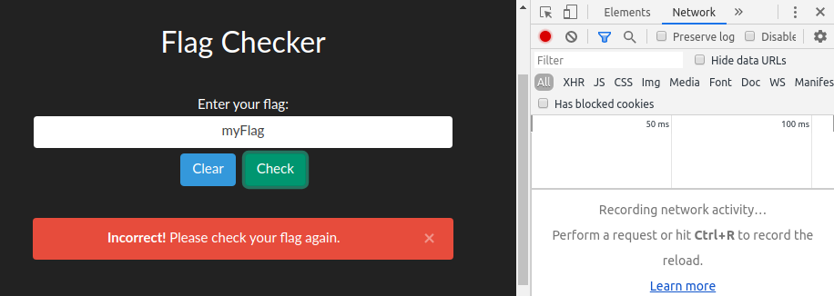
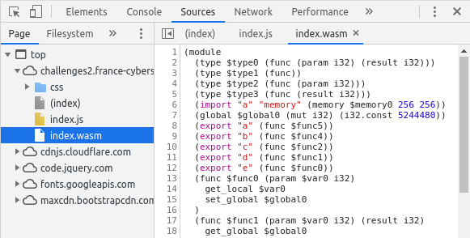

# Flag Checker

> Voici un service qui permet simplement de vérifier si le flag est correct.
> 
> URL : http://challenges2.france-cybersecurity-challenge.fr:5005/



We try the form with random input to see it react, it obviously returns an error but no request is made.

Let's have a look at the client-side sources.



[A WebAssembly program](index.wasm) ! Chromium can decompile it, but we can also decompile binary WASM programs with the [WebAssembly Binary Toolkit (wabt)](https://github.com/WebAssembly/wabt).

This gives us a file in `WebAssembly Text Format` (see docs [here](https://webassembly.org/docs/text-format/)). A quick look reveals several interesting parts:

```wat
(module
  ...
  (func $func4 (param $var0 i32) (result i32)
      ...
      loop $label0

        ;;
        ;; We XOR something with the constant 3
        get_local $var1
        get_local $var2
        i32.const 3
        i32.xor
        ...
      end $label0
    end
    get_local $var0

    ;;
    ;; Call $func3
    call $func3
    i32.eqz
  )
  
  ;;
  ;; Probably our encrypted flag
  (data (i32.const 1024)
    "E@P@x4f1g7f6ab:42`1g:f:7763133;e0e;03`6661`bee0:33fg732;b6fea44be34g0~"
  )
)
```

I tried, with no hope of success, to XOR the encrypted data with the constant `3`, as I feared to dive deeper into this pseudo-ASM code that I really dont know much of.

```
$ echo -n 'E@P@x4f1g7f6ab:42`1g:f:7763133;e0e;03`6661`bee0:33fg732;b6fea44be34g0~' | t xor -x 0x03
FCSC{7e2d4e5ba971c2d9e944502008f3f830c5552caff3900ed4018a5efb77af07d3}
```

Then my brain is safe from WASM brainfuckery :)